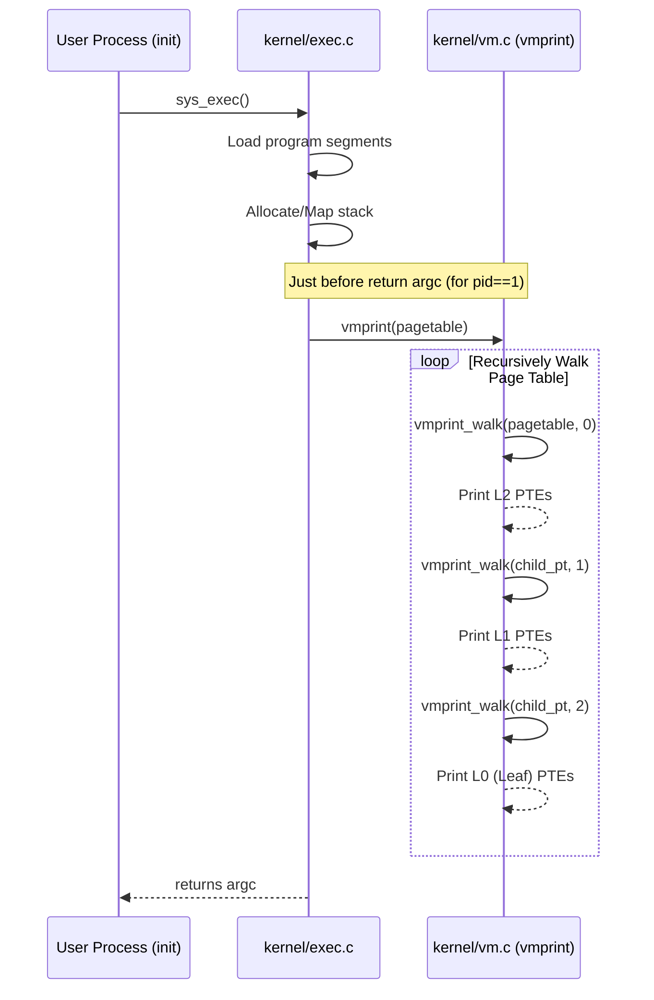
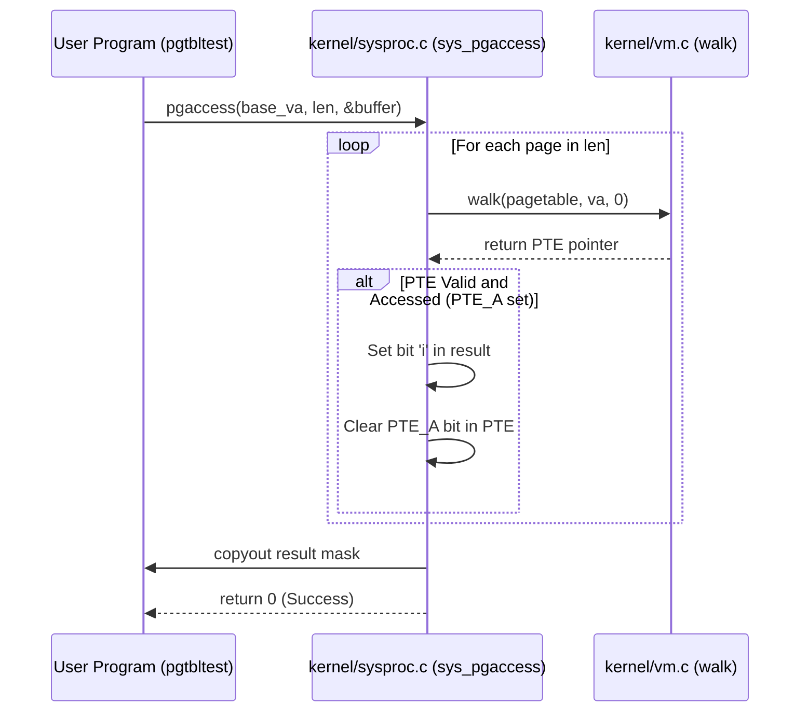

# Page Tables Project Report

## Overview
This project implements two main features for the xv6 operating system:
1.  **Page Table Visualization (`vmprint`)**: A utility to print the hierarchical page table structure of a process, aiding in debugging and understanding virtual memory mapping.
2.  **Page Access Detection (`pgaccess`)**: A system call that detects and reports which pages have been accessed by the user, useful for garbage collection algorithms.

## Feature 1: Print Page Table (`vmprint`)
-   **Functionality**: Recursively traverses the 3-level page table (L2, L1, L0) and prints valid Page Table Entries (PTEs) along with their physical addresses.
-   **Trigger**: Called in `exec.c` specifically for the first process (`init`, pid 1) to demonstrate functionality without spamming output for every process.
-   **Implementation**: `kernel/vm.c`

### Sequence Diagram


### Testing Command
Execute in terminal:
```bash
make clean
make qemu
```
**Observation**: You will see the page table printed (with `..` indentation) immediately after `xv6 kernel is booting`.


## Feature 2: Page Access Detection (`pgaccess`)
-   **Functionality**: Checks the "Accessed" bit (`PTE_A`) in the RISC-V PTEs for a specified range of user pages.
-   **Logic**:
    1.  Walks the page table for the given virtual addresses.
    2.  If `PTE_V` (Valid) and `PTE_A` (Accessed) are set, marks the corresponding bit in the result mask.
    3.  Clears the `PTE_A` bit to reset the "accessed" state for future checks.
    4.  Returns the bitmask to the user.
-   **Implementation**: `kernel/sysproc.c` (system call logic), `kernel/riscv.h` (bit definition).

### Sequence Diagram


### Testing Command
Inside xv6 shell, run:
```bash
pgtbltest
```
**Observation**:
```
pgaccess_test starting
pgaccess_test: OK
```

